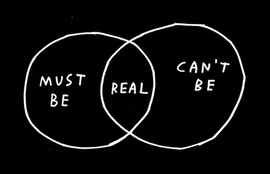
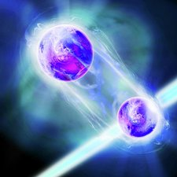
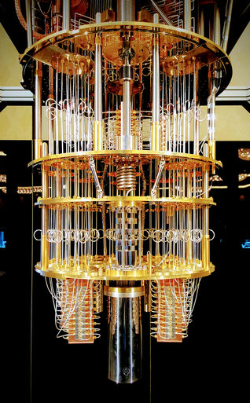

## Introduction
The computer has changed a lot since its first apparition. It's become smaller and more powerful, and as the size decreases, it gets more and more influenced by [quantum physics](https://www.sciencedaily.com/terms/introduction_to_quantum_mechanics.htm). This means that if a transistor doesn't allow an electron to go any further, the electron can transfer itself through a process called [quantum tunneling](https://www.azoquantum.com/Article.aspx?ArticleID=12). This is happening, because classic physics doesn't apply on a quantum scale, meaning less than 100 nanometers. So, in the '80s, the field of quantum computing was initiated. 
								
  
## Qbits 
Classic computers work on bits, that have 2 basic states. In a quantum computer we have qbits, that can be an electron’s internal angular momentum or spin, which has the peculiar quantum property of having only two possible projections on any coordinate axis: +1/2 or –1/2 (in units of the [Planck's constant](https://whatis.techtarget.com/definition/Plancks-constant)). This means you have 2 basic states as well: ↑ (that can be used as 0) and ↓ (that can be used as 1, because you need energy to make this electron be in such a state). 
This spin state is described by a formula that includes 2 complex numbers, let`s say α and β, wich are called [quantum amplitudes](https://en.wikipedia.org/wiki/Probability_amplitude). The rules of quantum mechanics say that the squares of these numbers must add up to 1 and each square represents the probability of finding the electron in the respective state. Why probability of finding? Because quantum physics has something called [superposition](http://www.physics.org/article-questions.asp?id=124), which means that the electron is in both states at the same time, but when you look at it it's only showing one of them. 
								

When you have a system of 2 qbits you need 4 complex numbers and their squares must add up to 1. In general, if you have a system of N qbits you would have 2 raised to the power of N amplitudes and this represents the power of the quantum computer. In other words, if you have a computer of 64 bits, it is as powerful as a quantum computer of 6 qbits. 
With the help of the [entanglement phenomenon](https://www.sciencedaily.com/terms/quantum_entanglement.htm), which means that all qbits depend one on another, you can look at the position of the first electron and calculate the position of all others. 
Quantum gates work different from normal gates. They have the input of a superposition and change it to another superposition. Basically an electron can be described by 3 vectors in space. These gates change these vectors, but we are talking about superposition, so these gates manipulate the probabilites of the qbits' state. The output of the the gate is another superposition.

## Utilites 
This new type of computer can be helpful in some areas, such as security, science and the ones where you run a program for a very long time, because a quantum algorithm can run it in that time's square root. 
### Science 
Simulations are very important for new discoveries. Usually they are run on computers and it takes a lot of time, because there are many variables that have to be calculated for a more accurate result. Quantum computers are working exponentially faster.
### Security
The biggest problem regarding the security of modern computers is the internet, which can cause (in some situations) information leaks. This is not a problem, when, with the help of the entanglement phenomenon, the infomarmation is not transmited physically, but on a quantum level. This means that one electron intersects another one (it does not matter if it's on the moon) and if we know in what state one electron is, we know the other one's, as well. In this way we can communicate. 

## Conclusion
This new type of computer can change the world, but it will not be the replacement for our classic computer. The algorithm of a quantum computer is very complicated, and doing simple tasks will not make it faster. Some researchers actually timed it at certain tasks and it performed poorer than digital computers. When it comes to really big algorithms that take more time, quantum computers are what we need.

## Development
This kind of technology is being developed by many companies, such as: Microsoft, Google, IBM, Intel. IBM made an online platform that allows the users to test a quantum algorithm on their quantum computer prototype, called [IBM Q](https://quantumexperience.ng.bluemix.net/qx/experience). 

This computer has 3 processors: 2 with 5 qbits and one with 16 qbits. 
Microsoft made a programming language called [Q#](https://www.microsoft.com/en-us/quantum/development-kit)( Q-sharp ), which can be used to simulate a program as if it was running on 30 qbits, or 40, if you use Azure. So, you can experience the quantum computer by yourself. I coded a small program in Q# to test the entanglement of qbits. You can find it [here](https://github.com/playerjack/Quantum-Computing/tree/master/Bell). 
   
